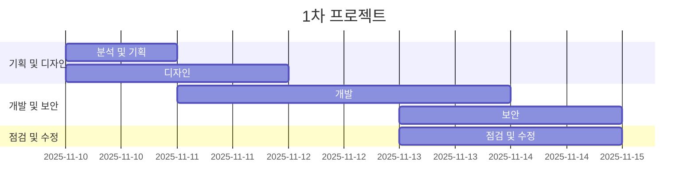

# 1차 PORTFOLIO
- 과정명 : [이스트캠프] 오르미 프론트엔드 개발(React, HTML/CSS/JavaScript)
- 기간 : 2025.10.16 ~ 2026.03.04
- 1차 프로젝트 : 2025.11.10 ~ 2025.11.17

## 빠른 링크
- [기획서] : 
- [디자인 원본] :

## 프로젝트 개요

### 1.1 목표

- **단점 보안** : 기존 사이트 단점 파악 후 수정하기
- **디자인 제작** : 기존 사이트와는 다른 팀만의 웹사이트 디자인 구축
- **디자인 구현** : 직접 디자인한 웹사이트를 코딩 (html/css)로 구현
- **웹표준 준수** : 웹표준 검사 진행하여 오류없는 사이트 제작
- **웹접근성 보안** : 웹접근성 검사 진행하여 더 나은 사이트로 보안

### 1.2 팀원

| 이름 | 역할 | 주요 담당 | GitHub |
| --- | --- | --- | --- |
| 신찬섭 | 팀장 · 기획 리드 | Header, banner, advantage, benefits 디자인<dr>main: advantage, benefits, Curriculum 구현 | @haini000 |
| 박성수 | 개발 리드 | introduce, reason, FAQ, Footer 디자인<dr>main: introduce, reason, Review, Apply Info, FAQ, fixed 요소들 구현 | @SeongSuTest |
| 김세은 | 디자인 리드 | Header, banner, Curriculum Re, Curriculum, Review, Apply Info 디자인<dr>header, footer 구현 및 main : banner, Curriculum Re 구현 | @Kim-Se-Eun |
| 조수현 | | | |

### 1.3 마일스톤

#### 1일차 - 기획/디자인
- [ ] 기존 사이트 분석
- [ ] 장단점 파악 및 기능 추가와 삭제
- [ ] 색상, 폰트 선정 및 레이아웃 

#### 2일차 - 디자인/개발
- [ ] 요소 배치 및 공통 요소 통합
- [ ] 디자인 병합 및 수정
- [ ] 각 담당 HTML 작성 및 틀 제작

#### 3일차 - 개발
- [ ] 각 파트 css 작성
- [ ] 피드백 적극 반영 및 수정
- [ ] 보안 및 수정사항 확인

#### 4일차 - 개발/보안
- [ ] html, css 개발 마무리
- [ ] 구현 사이트 점검
- [ ] css 통합 및 보안

#### 5일차 - 점검/통합
- [ ] 공통 부분 통합
- [ ] 웹표준 검사 진행 및 보안
- [ ] 웹접근성 검사 진행 및 보안

